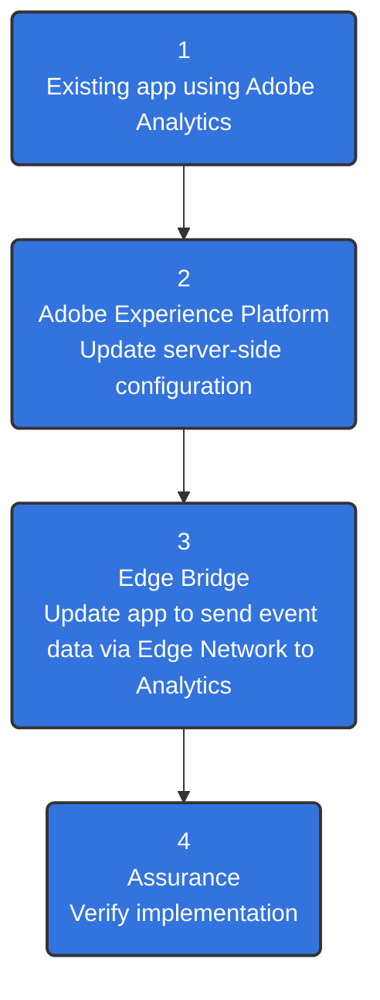
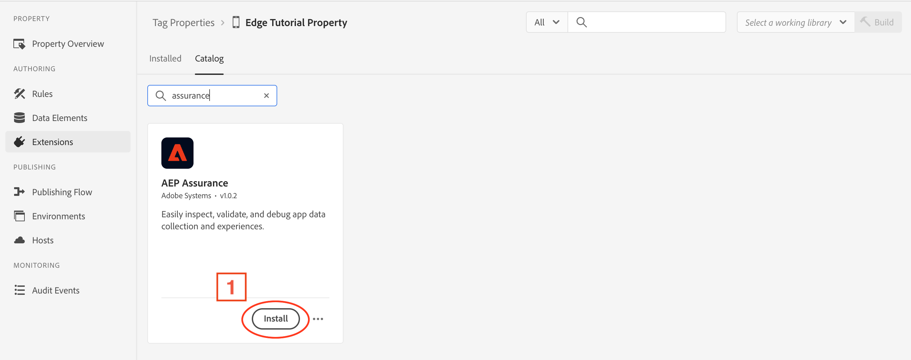
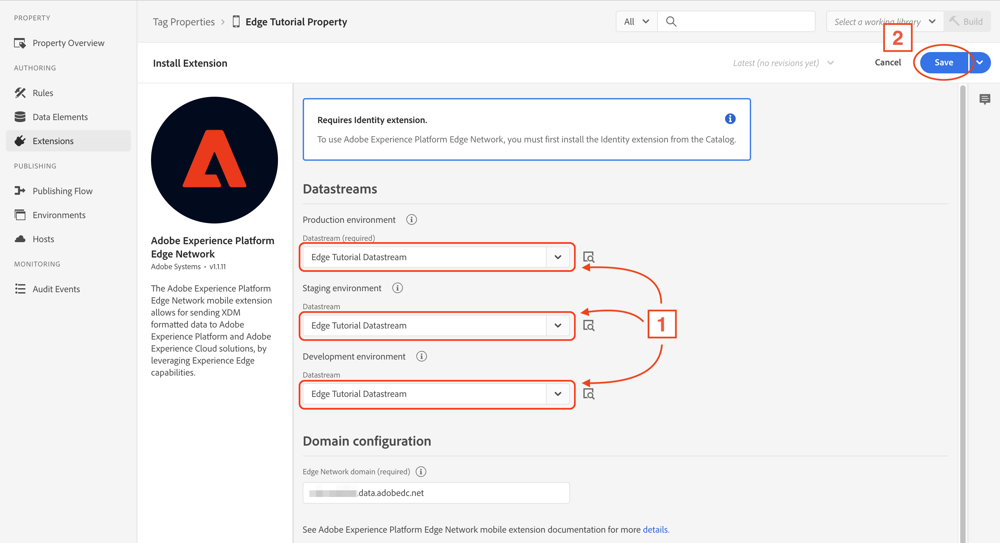
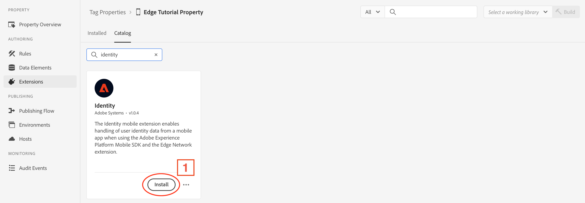
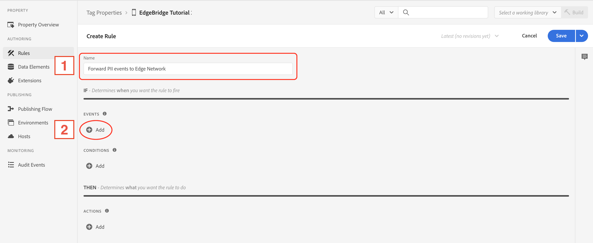
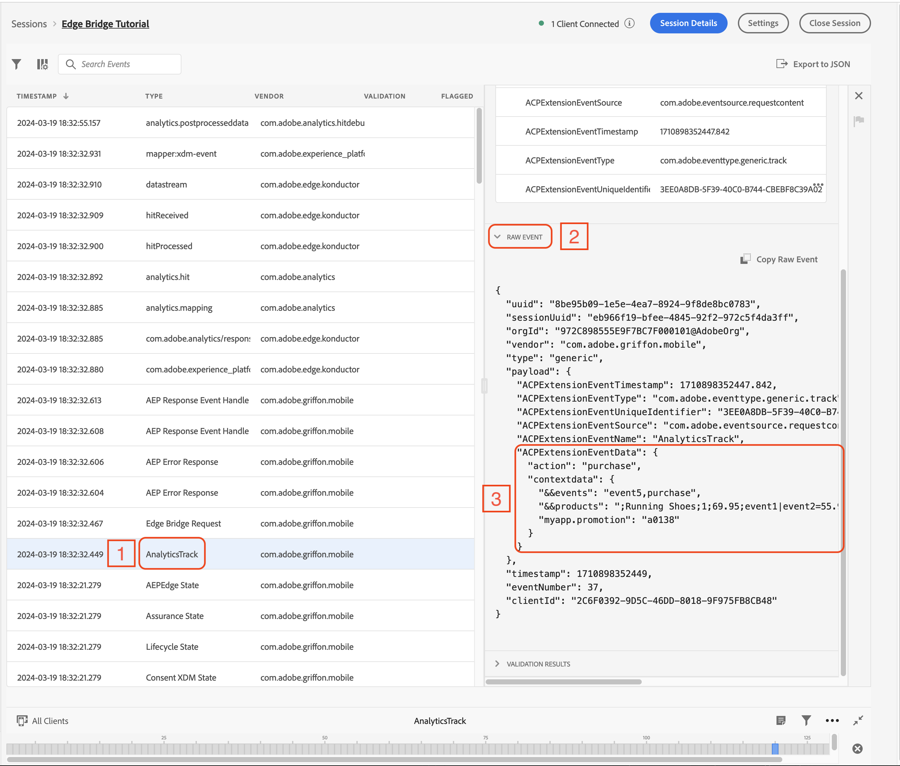
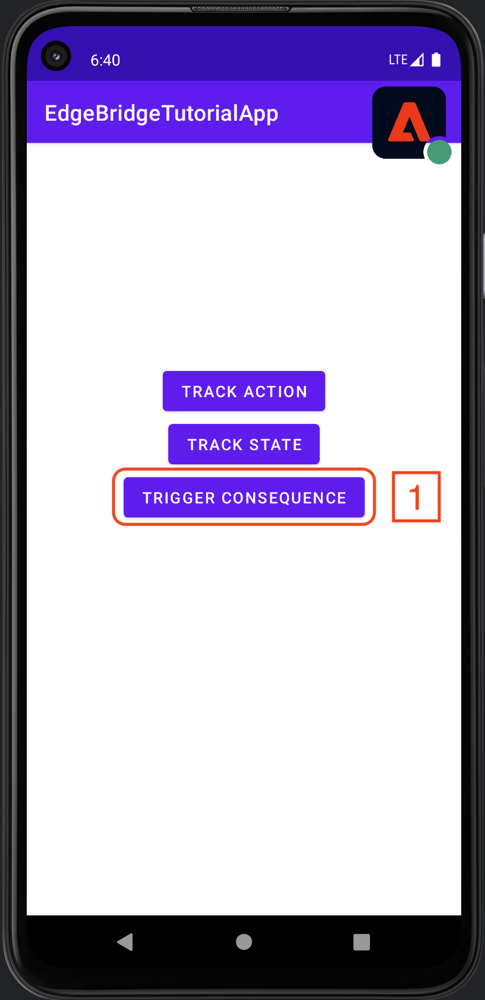

# Migrating from Analytics mobile extension to the Edge Network using the Edge Bridge extension <!-- omit in toc -->

> [!IMPORTANT]
> Version 3.x of the Edge Bridge extension uses a new data format compared to the previous versions. If you are using version 2.x or lower of the Edge Bridge extension, please find the relevant tutorials [here](https://github.com/adobe/aepsdk-edgebridge-android/tree/v2.1.0/Documentation/tutorials). </br>
> If you want to learn more about the benefits of upgrading to version 3.x, see the [Edge Bridge migration guide](https://developer.adobe.com/client-sdks/resources/migration/android/migrate-to-2x).

## Table of Contents <!-- omit in toc -->
- [Overview](#overview)
  - [Environment](#environment)
  - [Prerequisites](#prerequisites)
- [Adobe Experience Platform setup](#adobe-experience-platform-setup)
  - [1. Set up mobile property](#1-set-up-mobile-property)
  - [2. Configure a rule to forward personally identifiable information (PII) events to Edge Network](#2-configure-a-rule-to-forward-personally-identifiable-information-pii-events-to-edge-network)
- [Client-side implementation](#client-side-implementation)
  - [1. Get a copy of the files (code and tutorial app)](#1-get-a-copy-of-the-files-code-and-tutorial-app)
  - [2. Install Edge Bridge using dependency manager (Gradle)](#2-install-edge-bridge-using-dependency-manager-gradle)
  - [3. Update tutorial app code to enable Edge Bridge functionality](#3-update-tutorial-app-code-to-enable-edge-bridge-functionality)
  - [4. Run app](#4-run-app)
  - [5. `trackAction`/`trackState` implementation examples](#5-trackactiontrackstate-implementation-examples)
- [Validation with Assurance](#validation-with-assurance)
  - [1. Set up the Assurance session](#1-set-up-the-assurance-session)
  - [2. Connect the app to the Assurance session](#2-connect-the-app-to-the-assurance-session)
  - [3. Event transactions view - check for Edge Bridge events](#3-event-transactions-view---check-for-edge-bridge-events)
- [Optional - Map track event data with Data Prep for Data Collection](#optional---map-track-event-data-with-data-prep-for-data-collection)

## Overview
This tutorial covers how to use Edge Bridge as a drop-in solution for migrating from an existing Analytics implementation to sending data via the Edge Network to Analytics.



### Environment
- Android Studio version which supports Gradle plugin 8.2.
- Android emulator or device.

### Prerequisites
> [!NOTE]
> The tutorial app for this exercise already includes the Edge extensions. To learn more about these extensions, please see the [Edge extension tutorials](https://github.com/adobe/aepsdk-edge-android/tree/main/Documentation/Tutorials).
1. A timestamp enabled report suite configured for mobile data collection.
2. A tag (also known as a mobile property) configured in the Data Collection UI, which has the Adobe Analytics extension installed and configured.

## Adobe Experience Platform setup
This section demonstrates how to create and configure a mobile property in Experience Platform, which controls the configuration settings for the Mobile SDK extensions used in this tutorial.

<details>
  <summary> <b>Setup instructions - Skip this section if prerequisite item 2 has already been set up.</b> </summary>

### 1. Set up mobile property  
To create a new mobile property, refer to the [instructions on how to set up a new property](https://github.com/adobe/aepsdk-edge-android/blob/main/Documentation/Tutorials/edge-send-event-tutorial.md#1-create-a-schema).

Install the following Experience Platform extensions:  

<details>
  <summary> Adobe Analytics </summary><p>

Open the **Catalog** and install the **Adobe Analytics** extension.

  

In the extension configuration settings window, set the report suite ID (**1**) for each environment (**2**) to the one designated for this tutorial. Then, select **Save** (**3**).

  

</p></details>

<details>
  <summary> AEP Assurance </summary><p>

Open the **Catalog** and install the **AEP Assurance** extension.

  

</p></details>

<details>
  <summary> Adobe Experience Platform Edge Network </summary><p>

Open the **Catalog** and install the **Adobe Experience Platform Edge Network** extension.

  

In the extension configuration settings window, set the datastream for each environment (**1**) to the one designated for this tutorial. Then, select **Save** (**2**).

  

</p></details>

<details>
  <summary> Identity </summary><p>

Open the **Catalog** and install the **Identity** extension. There are no settings to configure for this extension.

  

</p></details>

<details>
  <summary> Consent </summary><p>

Open the **Catalog** and install the **Consent** extension.

  

In the extension configuration settings window, the **Default Consent Level** should be set to **Yes** by default (**1**). 

> ⚠️ **Important**  
> For the tutorial app, this setting is acceptable as-is. However, when configuring this setting in production applications, it should align with the organization's data collection and privacy policies.

  

</p></details>

The following cards should be visible once all the extensions have been installed:

  

### 2. Configure a rule to forward personally identifiable information (PII) events to Edge Network
The [`collectPII`](https://developer.adobe.com/client-sdks/home/base/mobile-core/api-reference/#collectpii) API for Analytics does not send events to Edge Network by default; it requires a rule to be configured to forward these events. This section provides an example of how to create such a rule.

#### Create a rule <!-- omit in toc -->
1. In the Rules tab, select **Create New Rule**.
   - If your property already has rules, the button will be in the top right of the screen.
2. Give the rule a recognizable name (**1**) in your list of rules. 
   - In this example, the rule is named "Forward PII events to Edge Network".
4. In the **EVENTS** section, select **Add** (**2**).

  

#### Define the event <!-- omit in toc -->

1. From the **Extension** dropdown list (**1**), select **Mobile Core**.
2. From the **Event Type** dropdown list (**2**), select **Collect PII**.
3. Select **Keep Changes** (**3**).

  

#### Define the action <!-- omit in toc -->
1. Under the Actions section, select **+ Add** (**1**).

2. From the **Extension** dropdown list (**1**), select **Adobe Analytics**.
3. From the **Action Type** dropdown list (**2**), select **Track**.
4. Name the **Action** field (**3**) "collect_pii", in the right-side window.
5. Select the **+** (**4**) next to **Context Data** and set the **Key** to "ruleKey" and **Value** to "ruleValue" (**5**).
6. Select **Keep Changes** (**6**).

  

#### Save the rule and rebuild your property <!-- omit in toc -->
1. After completing your configuration, verify that your rule appears as follows:
2. Select **Save** (**1**).

  
</details>

## Client-side implementation
### 1. Get a copy of the files (code and tutorial app)
1. Open the code repository: https://github.com/adobe/aepsdk-edgebridge-android
2. Select the green **Code** button in the top right.
3. In the window that opens, select **Download ZIP**; by default, it should download to your **Downloads** folder.
4. Unzip the archived file by opening it.
6. Open **Android Studio**, then select **File** -> **Open**.
7. Navigate to the unarchived folder, then navigate to **Documentation** -> **tutorials** -> **EdgeBridgeTutorialAppStart**.
8. Open the file **settings.gradle**.

### 2. Install Edge Bridge using dependency manager (Gradle)
The next task is to update the necessary dependencies to enable the Edge Bridge extension to function.

1. In Android Studio, click the dropdown chevron next to **Gradle Scripts** in the left-side project navigation panel.
   - If the **Project** navigation panel is not visible, from the top menu, select **View** -> **Tool Windows** -> **Project**.
2. Select the file **build.gradle (Module: :app)**

Inside, you will see code blocks for this tutorial that are greyed out because they are commented out. They are marked by the header and footer `Edge Bridge tutorial - code section (n/m)` (where `n` is the current comment section number and `m` is the total number of sections in the file).

To uncomment the section and activate the code, simply add a forward slash at the beginning of the header:
```java
/* Edge Bridge tutorial - code section (1/1)
```
To:
```java
//* Edge Bridge tutorial - code section (1/1)
```

> [!WARNING]
> The tutorial app removes Identity because aside from Analytics, no other [Adobe Experience Cloud Solution extensions](https://developer.adobe.com/client-sdks/solution/) are in use, such as Adobe Target or Adobe Campaign. If following along with a different app, only remove Identity if no other solution extensions are in use.

1. Add a forward slash in front of the header `/* Edge Bridge tutorial - code section` to install the Edge Bridge (`AEPEdgeBridge`) extension.
2. Delete everything between the headers: `Edge Bridge tutorial - remove section` to remove the Analytics (`AEPAnalytics`) and Identity (`AEPIdentity`) extensions.
3. Sync these changes to the Gradle file with the project:
   1. You should see a ribbon appear at the top of the code view window, with text like: "Gradle files have changed since last project sync. A project sync may be necessary for the IDE to work properly." Select **Sync Now**.
   2. Alternatively, use **File** -> **Sync Project with Gradle Files**.

### 3. Update tutorial app code to enable Edge Bridge functionality
#### Add the Edge Bridge extension <!-- omit in toc -->
The file `MainApp.java` needs to be updated to enable the **Edge Bridge** extension.

1. In the left-side project navigation panel (with Android view selected), select the dropdown chevrons to expand the folders: **app** -> **java** -> **com.adobe.marketing.mobile.tutorial**.
2. Open the file **MainApp.java**.

Uncomment the code blocks marked with the header `/* Edge Bridge tutorial - code section` by adding a forward slash at the beginning of the header, enabling:
1. The import statement for Edge Bridge.
2. The registration of Edge Bridge.

**Set the tutorial app to use the mobile property ID:**
1. Update the `ENVIRONMENT_FILE_ID` value to the mobile property ID published in the first section.
   - See how to find your mobile property ID in the instructions for [getting the mobile property ID](https://github.com/adobe/aepsdk-edge-android/blob/main/Documentation/Tutorials/edge-send-event-tutorial.md#getting-the-mobile-property-id).

**Remove the Analytics and Identity extensions:**  
Remove all code blocks marked with the header and footer `Edge Bridge tutorial - remove section`, removing:
1. The import statement for Analytics.
2. The registration of Identity and Analytics.

For details on the various Edge extensions used, see the [table of related projects](../../README.md#related-projects).

### 4. Run app
In Android Studio:
1. Set the app target to **app**.
2. Choose which destination device to run it on.
3. Click the green play button.

You should see your application running on the selected device, with logs displayed in the Android Studio console.

> [!TIP]
> If the log console area is not shown by default, activate it by selecting: **View** -> **Tool Windows** -> **Logcat**

### 5. `trackAction`/`trackState` implementation examples
With the Edge Bridge extension successfully installed and registered, you can continue to make existing Analytics `trackAction` and `trackState` calls. These will be captured by the Edge Bridge extension and sent to the Edge Network.

Check `EdgeBridgeFragment.java` for implementation examples of both APIs. You will see the data payloads that are sent with each call.

## Validation with Assurance
Assurance is the Experience Platform tool for inspecting all events that Adobe extensions send out in real time. It allows observing the flow of events, including the Edge Bridge conversion of `trackAction`/`trackState` events.

### 1. Set up the Assurance session
To create a new Assurance session and connect to it, see the instructions on [setting up an Assurance session](https://github.com/adobe/aepsdk-edge-android/blob/main/Documentation/Tutorials/edge-send-event-tutorial.md#1-set-up-the-assurance-session), using the base URL value:
```
edgebridgetutorialapp://main
```

### 2. Connect the app to the Assurance session
To connect the tutorial app to the Assurance session, see the instructions on [connecting the app to the Assurance session](https://github.com/adobe/aepsdk-edge-android/blob/main/Documentation/Tutorials/edge-send-event-tutorial.md#2-connect-to-the-app).

### 3. Event transactions view - check for Edge Bridge events
#### `trackAction`/`trackState` events<!-- omit in toc -->
To view Edge Bridge events in the connected app instance:
1. Trigger a `trackAction` or `trackState` (**1**) within the app, which the Edge Bridge extension will convert into Edge events. These events will be captured by the Assurance extension and displayed in the web session viewer.


1. Select the **AnalyticsTrack** event (**1**) in the events table to view the event details in the right side window.
2. Select the **RAW EVENT** dropdown (**2**) in the event details window to view the event data payload.
3. Verify that the `contextdata` matches what was sent by the Analytics `trackAction`/`trackState` API.



1. Now select the **Edge Bridge Request** event (**1**) in the events table.
2. Select the **RAW EVENT** dropdown (**2**) in the event details window; observe the transformation of the payload structure (**3**) with the help of the Edge Bridge extension. The **Edge Bridge Request** event conforms to the format of an Edge Network event.


The following table and diagram highlight the differences in event data structure and format between the two types of events: Analytics (left) vs Edge (right) when using the Edge Bridge extension:

| Item | Before (Analytics) | After (Edge Bridge) |
| --- | --- | --- |
| 1 | Top level `ACPExtensionEventType`: `generic.track` | Top level `ACPExtensionEventType`: `edge`<br>`ACPExtensionEventData.xdm.eventType`: `analytics.track` |
| 2 | `contextdata` key under `ACPExtensionEventData` | `contextData` transformed and moved under `data.__adobe.analytics` |
| 3 | Keys with reserved prefix `&&` directly under `contextdata` | Keys with prefix `&&` transformed and moved under `data.__adobe.analytics` |
| 4 | No Analytics metrics | Analytics metrics added under `data.__adobe.analytics` (varying locations) |


> [!NOTE]
> The two new top-level properties `xdm` and `data` are standard Edge Network event properties, integral to Experience Platform's [Experience Data Model (XDM)](https://experienceleague.adobe.com/en/docs/experience-platform/xdm/home) schema-based system for event data organization. This system allows for powerful, customizable data processing.

To learn more about the final data format created by Edge Bridge, please refer to the [data format documentation](../data-format.md).

#### Trigger rule-based `trackAction` events<!-- omit in toc -->
Rule-based `trackAction`/`trackState` events are also converted to Edge events by the Edge Bridge extension. Select the **Trigger Consequence** button (**1**) to initiate a rule that generates a `trackAction` event.



> [!TIP]
> If no `trackAction` event is dispatched upon selecting the **Trigger Consequence** button, verify that your mobile property is [set up with the correct rule](#2-configure-a-rule-to-forward-personally-identifiable-information-pii-events-to-edge-network).

Just like the `trackAction`/`trackState` events above, the Edge Bridge extension converts the PII `trackAction` event into an Edge event.

With this, the migration from an existing Analytics implementation to sending data via Edge Network to Analytics, powered by Edge Bridge, is complete!

## Optional - Map track event data with Data Prep for Data Collection
Edge Bridge transforms track events into an Edge Network event format suitable for Adobe Analytics, so that mapping data to [Experience Data Model (XDM)](https://experienceleague.adobe.com/docs/experience-platform/xdm/home.html) is not required for Analytics. However, to use this same event data in other Experience Platform applications, it must first be mapped to the XDM specification using [Data Prep for Data Collection](https://experienceleague.adobe.com/en/docs/experience-platform/datastreams/data-prep).

The tutorial [Map track event data with Data Prep for Data Collection](data-prep-tutorial.md) covers how to create these mappings.